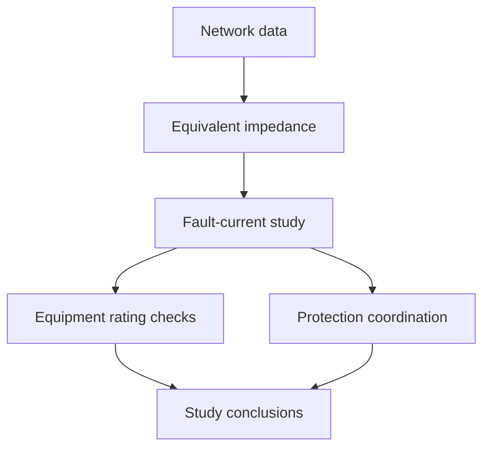

# Industrial short-circuit and protection coordination study

**Noureddine Qarafi · ENSAM Meknès · OCP Jorf Lasfar**

A technical portfolio summary of an HTA/BT electrical distribution study in a fertilizer production environment. The work follows the path from network modeling and short-circuit calculations to checking protective-device ratings and coordinating overcurrent relays.

> The accompanying PDF is a study report assembled from a reference document. Its figures, equipment identifiers, detailed settings, and numerical source data belong to that report. This public-facing summary does not reproduce the plant single-line diagrams or relay-setting sheets. The original ETAP project file and editable LaTeX source were not supplied with this repository.

## Scope

- Model the upstream supply, cables, transformers, and motor contribution as equivalent impedances.
- Estimate maximum and minimum fault currents following the IEC 60909 approach used in the report.
- Compare calculated fault levels with the breaking and making capabilities of protective devices.
- Review time and current grading of ANSI 50/51 overcurrent protection, with downstream devices operating first.
- Compare hand calculations with the ETAP results **reported in the source document**. The ETAP model itself is not included.

## Methods and reported outcomes

| Stage | What the report covers |
| --- | --- |
| Network model | HTA supply, distribution cables, HTA/BT transformers, and asynchronous motors |
| Short-circuit study | Three-phase and two-phase faults; symmetrical initial current and peak current |
| Equipment checks | Comparison of prospective fault current with device interrupting and making ratings |
| Coordination | Current thresholds and time grading across motor feeders, distribution boards, coupling, and incoming feeders |
| Simulation comparison | ETAP results reproduced and discussed in the report; no independently runnable model is provided |

The report gives fault currents on the order of **20 kA at an HTA bus** and **29 kA at a BT bus** in the studied configurations. These figures are context-specific findings from the supplied report, not settings or design values to apply elsewhere.

## Repository contents

- [`docs/methodology.md`](docs/methodology.md) — calculation method, coordination logic, and practical limitations.
- [`docs/report-map.md`](docs/report-map.md) — guide to the chapters and figures in the complete PDF.
- `full-report.pdf`
- 
